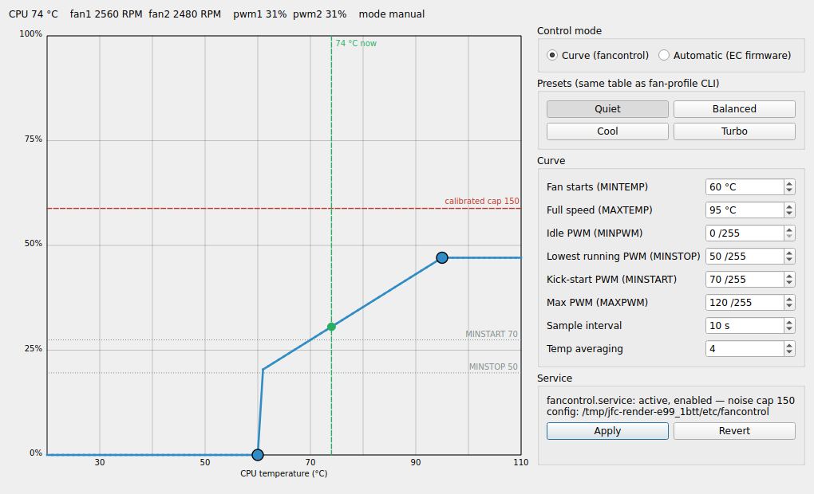
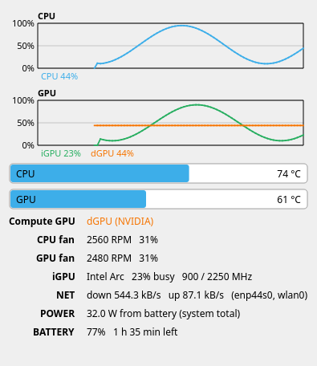

# juno-kde-fancontrol

The whole fan stack for Juno (Clevo) laptops in one Debian package: the
`fan-profile` CLI, the systemd drop-in that keeps `fancontrol` pinned to this
boot's hwmon indices, the suspend/resume hook, a KDE/Qt6 curve editor and a
system-tray monitor. Everything sits on top of stock `fancontrol` rather than
replacing it. Pure Python/PySide6 (System 6 KCMs are C++ plugins, so the
editor is a standalone app).



## What it does

- Live strip: CPU package temp, per-fan RPM, current PWM %, control mode
  (fancontrol manual vs EC auto), refreshed every second.
- Draggable curve chart: `pwm = f(temp)`, same control law `fancontrol`
  applies (`MINPWM` below MINTEMP, integer ramp `MINSTOP→MAXPWM`, `MAXPWM`
  above MAXTEMP). Two handles: `(MINTEMP, MINPWM)` and `(MAXTEMP, MAXPWM)`.
  The marker in the scheme's positive colour is the live `(temp, pwm)` point;
  the dashed line in its negative colour is the calibrated noise cap from
  `/etc/fan-profile.maxpwm`.
- Click the plot to add a knob and the chart becomes a multi-point curve
  (up to 16 knobs), each knob draggable, right-click to remove one. The handle
  under the pointer grows and carries its own `78 °C → 47%` readout, since the
  axes cannot be read to a degree mid-drag. See [Knob curves](#knob-curves).
- On a machine with a discrete GPU an `Editing:` selector above the chart gives
  the GPU fan (pwm2) its own curve, driven by the dGPU temperature rather than
  the CPU package. See [The GPU fan](#the-gpu-fan).
- Reachable from **System Settings → System → Fan Control** as well as from the
  launcher. See [System Settings integration](#system-settings-integration).
- Every colour comes from the active KDE colour scheme, so a Breeze/Breeze Dark
  switch moves the charts with it. See [Theming](#theming).
- Presets are scraped from the installed `fan-profile` at runtime (`/usr/bin`
  first, then `/usr/local/bin` for a manual install) — the
  GUI can never drift from the CLI table (quiet/balanced/cool/turbo). Any
  edit turns the profile into `custom`.
- `Automatic (EC firmware)` hands the fans back to the EC
  (`fan-profile auto`).
- Apply runs `pkexec /usr/sbin/juno-fancontrol-apply` (or the `/usr/local`
  variant from a manual install), which writes `/etc/fancontrol` in
  fan-profile's exact byte format (hwmon indices and pwm channel count
  re-resolved from `/sys` at apply time — they drift between boots), honors
  the calibrated cap unless
  the preset is `turbo`, validates with `fancontrol --check` (syntax), then
  restarts `fancontrol.service` and probes `is-active` (the real device
  gate — `regen` in the service's ExecStartPre re-validates indices). On any
  failure it restores the previous config AND restarts the previous daemon.

## Knob curves

`fancontrol` interpolates exactly one linear segment. `UpdateFanSpeeds` computes

```
pwm = (tval - MINTEMP) * (MAXPWM - MINSTOP) / (MAXTEMP - MINTEMP) + MINSTOP
```

and there is no breakpoint table anywhere in the script, so a multi-point curve
cannot be written into `/etc/fancontrol` directly.

Knob mode does not replace the daemon. It feeds `fancontrol` a *virtual*
temperature and calibrates that one segment into the identity. `FCTEMPS` accepts
a `!`-prefixed executable in place of a hwmon path and uses the command's stdout
as the reading, so knob mode writes

```
# Knobs pwm1: 45:0 60:55 75:110 95:130
FCTEMPS=hwmon7/pwm1=!/usr/bin/juno-fan-curve ...
MINTEMP=hwmon7/pwm1=0
MAXTEMP=hwmon7/pwm1=255
MINSTOP=hwmon7/pwm1=0
MINPWM=hwmon7/pwm1=0
MAXPWM=hwmon7/pwm1=255
```

With that calibration the law collapses to `pwm = tval * 255 / 255000 =
tval / 1000` in exact integer arithmetic. `juno-fan-curve` reads the real CPU
temperature, evaluates the polyline through the knobs, and prints
`pwm * 1000` millidegrees; `fancontrol` writes back exactly that `pwm`.
`tests/test_fancore.py::test_knob_transfer_is_exact_through_the_real_fancontrol_law`
pushes random curves through the packaged script's own arithmetic and requires
the commanded value back, bit for bit.

Three consequences worth knowing:

- **The failure mode is thermally safe.** A non-zero exit from the `!` command
  sends `fancontrol` into `restorefans`, which restores the saved `pwm_enable`
  (EC auto) and falls back to full speed. `juno-fan-curve` therefore exits
  non-zero on every error path rather than guessing a temperature, and
  `fan-profile regen` leaves the config untouched when the helper is missing.
- **`AVERAGE` now smooths the commanded PWM**, not the temperature, because the
  reported value *is* the PWM. It is a moving average over the last `AVERAGE`
  samples (`fancontrol` line 642), so a step change takes `AVERAGE × INTERVAL`
  seconds to reach the set point: 40 s at the shipped `AVERAGE=4, INTERVAL=10`.
  That lag is the same in both modes — a 60→95 °C step gives native
  `0,0,0,66,84,102,120` and knob `50,50,50,67,85,102,120`, both settling in four
  intervals — so knob mode neither adds nor removes it.
- **The MIN/MAX keys stop being a curve.** `fan-profile status` prints the knobs
  instead, `regen` carries the `# Knobs` line(s) through untouched, and the
  calibrated noise cap is applied to the knobs (`cap_knobs`) rather than to
  `MAXPWM`, where it would rescale every commanded value by `cap/255`.

Knob curves always honor the calibrated cap: `--knobs` and `--ignore-cap` are
mutually exclusive in the root helper, since `regen` re-applies the cap at every
boot and an exemption would last only until the next reboot.

## The GPU fan

pwm1 cools the CPU, pwm2 the GPU/chassis on this board family. With a dGPU the
two fans stop sharing the CPU temperature:

- **pwm2 follows the dGPU temperature, never the CPU's.** In every mode its
  `FCTEMPS` entry is an executable source: `juno-gpu-temp` (plain millidegrees)
  in native configs, `juno-gpu-curve` (the pwm2 knob curve as a virtual
  temperature) in knob mode. The config carries one `# Knobs pwmN:` line per
  fan; the knob-helper arguments and the regen/cap machinery all split per fan.
- **A runtime-suspended card is cold, not queried.** Reading a suspended GPU
  resumes it (~10 W), so the sources synthesize 25 °C from the power state
  alone and the GPU fan sits at the floor of its curve. The never-wake order is
  tested by logging every fake nvidia-smi call and requiring the log to stay
  empty.
- **A broken driver stack degrades, not panics.** An awake card whose
  `nvidia-smi` fails falls back to `coretemp`, because a permanently failing
  `FCTEMPS` source would abort `fancontrol` into `restorefans` every INTERVAL —
  strictly worse than following the neighbouring heat source.
- **The UI shows it only when it exists.** No dGPU means no selector and the
  old single-curve window everywhere (GUI, `fan-profile`, the helper), so the
  feature cannot drift into a phantom second fan.

The CPU/GPU split is per-board wiring (`pwm1`/`pwm2`); the EC's own labels are
the generic `Fan 1`/`Fan 2` and carry the mapping nowhere.

## System Settings integration

`systemsettings` builds its module list from compiled KCM plugins plus every
`*.desktop` under `$XDG_DATA_DIRS/plasma/systemsettings/externalmodules`
(`app/kcmmetadatahelpers.h`, `findExternalKCMModules`). It reads `Name`,
`Icon`, `Comment`, `Exec`, `X-KDE-System-Settings-Parent-Category` and
`X-KDE-Weight` from each one, and shows the entry as a page that launches the
program. The package ships `juno-fancontrol-settings.desktop` there, under
`system-administration` at weight 75, which puts **Fan Control** beside **Power
Management** rather than among the per-peripheral panels in Connected Devices.

A settings *page* rendered inside the System Settings window would have to be a
C++ `KCModule` plugin or a QML KPackage — that process loads no Python — so the
page hosts the launch, and the editor opens as its own window. That is the
mechanism upstream provides for a non-C++ program, and it is the ceiling here.

The scan runs once, when the module list is built at startup, so a System
Settings window that was already open when the package landed does not show the
entry until it is restarted.

Selecting the entry is not needed to verify it is found: `systemsettings --list`
runs the identical lookup, and `tests/test_settings_entry.sh` is that check as a
gate — it stages the entry in a throwaway `XDG_DATA_DIRS`, installs nothing, and
carries a negative control (with the stage removed the entry must disappear, or
the lookup proves nothing). It is not part of the container gate because
installing `systemsettings` in `debian:unstable` pulls 288 packages — which is
also why the package only `Suggests:` it rather than pulling most of Plasma onto
a machine that is not running it.

```sh
$ systemsettings --list | grep juno
juno-fancontrol-settings     - Fan curve, presets and the EC automatic mode for this laptop
```

The window, the launcher entry and the settings entry share one icon and one
desktop-file name (`app.setDesktopFileName`), which is what lets Plasma match
the window to the application on Wayland instead of showing a generic icon.

## Theming

`QPalette` carries no semantic colour roles, so a hardcoded red stays red under
a scheme whose negative is not red. `KColorScheme` has the roles and no Python
bindings, so `backend/ktheme.py` reads the same ini KConfig reads
(`Colors:View` in the first `kdeglobals` on the XDG path) and maps one colour
per meaning:

| element | role |
|---|---|
| calibrated noise cap | `ForegroundNegative` |
| live `(temp, pwm)` marker | `ForegroundPositive` |
| the curve and its handles | `DecorationFocus` |
| handle under the pointer, and its readout | `DecorationHover` |
| MINSTOP/MINSTART guides, hints, tray hint | `ForegroundInactive` |
| tray CPU / iGPU / dGPU series | `DecorationFocus` / `ForegroundPositive` / `ForegroundNeutral` |
| warnings on the status line, hot tray icon | `ForegroundNegative` |

Neither GUI calls `setStyle()`: forcing Fusion over Breeze is what made this
look unthemed. The renders pass `--style` explicitly instead.

Measured over every scheme installed here, `ForegroundPositive`,
`ForegroundNegative`, `ForegroundNeutral` and `DecorationFocus` are
byte-identical in `BreezeLight`, `BreezeDark` and `BreezeClassic`, so they are
safe as the fallback when no scheme file exists (a non-KDE session, or the
offscreen renders). `DecorationHover` is not — `BreezeClassic` uses
`147,206,233` — and `ForegroundInactive` is not either, because it tracks light
against dark. `ForegroundInactive` is resolved instead against the window under
a contrast floor: the scheme's value, then the palette's disabled text, then the
Breeze value for that polarity, first one that clears 3.0:1.

The floor is 3.0 (WCAG 2.1 §1.4.11, UI components) and not 4.5 (§1.4.3, normal
text) deliberately. BreezeLight's own `ForegroundInactive` scores 3.69 against
its window and 4.21 against its View background, so a 4.5 floor would reject the
default KDE light scheme and paint a grey no other application uses. Raising it
means overriding the user's choice.

Changing the colour scheme while the app runs repaints it. Qt delivers an
app-wide palette change to each window as `PaletteChange`, which drops the
memoized scheme read and repaints; `kdeglobals` is watched as well, because the
palette event can arrive before the scheme applier has finished rewriting the
file. The tray hint carries an inline stylesheet, which wins over the palette,
so it is re-set explicitly — and only when it changed, since `setStyleSheet`
itself posts a `PaletteChange`.

`ktheme` parses the ini itself rather than through `QSettings`: `QSettings`
keeps a process-wide cache keyed on a file's timestamp and size, so a scheme
switch that rewrites `kdeglobals` to the same size within the same second is
invisible to it, `sync()` included.

## The tray monitor

`juno-fan-monitor` puts the CPU package temperature in the system tray
(red above 85 °C) and opens this panel on click:



- Rolling 90-sample chart of CPU, iGPU and dGPU utilization. The dGPU joins
  the chart only while it is awake.
- CPU and GPU fan, one row each: RPM and PWM duty, read through the same
  `backend/fancore.py` the editor uses.
- Every row and the chart is individually switchable (tray menu → **Probes…**),
  and the choice persists across restarts.
- iGPU busy % from i915 RC6 residency and the current/max render clock. The
  i915 PMU needs `CAP_PERFMON`, so RC6 residency is what an unprivileged
  process can read.
- dGPU state from the PCI `power/runtime_status` node **first**; `nvidia-smi`
  runs only when the card is already awake, because querying a suspended GPU
  resumes it and costs about 10 W.
- Network throughput summed over physical interfaces only — an interface is
  physical when `/sys/class/net/<if>/device` exists, which drops `lo`,
  bridges, veth pairs and VPN tunnels in one rule.
- Battery percentage plus time to empty (or to full while charging), from
  `ENERGY_NOW/POWER_NOW` when the driver exposes them, otherwise
  `CHARGE_NOW × VOLTAGE_NOW / CURRENT_NOW`.
- Total system power: on battery, `POWER_NOW`. On AC it needs the RAPL
  `psys` counter, which is root-only since PLATYPUS (CVE-2020-8694); the
  panel prints the one-time `udev` rule that grants group read
  (`/usr/share/juno-kde-fancontrol/rapl-readable.rules`).

Everything the panel reads is a plain sysfs or procfs file. `backend/sysmon.py`
takes every path as an argument, so `tests/test_sysmon.py` drives it against a
fixture tree with no hardware at all.

## What the package installs

| path | role |
|---|---|
| `/usr/bin/fan-profile` | profile CLI: `quiet`, `balanced`, `cool`, `turbo`, `auto`, `status`, `regen` |
| `/usr/bin/fan-calibrate` | measures fan noise vs PWM with the mic, writes `/etc/fan-profile.maxpwm` |
| `/usr/bin/juno-kde-fancontrol` | the curve editor |
| `/usr/bin/juno-fan-monitor` | the tray monitor |
| `/etc/xdg/autostart/juno-fan-monitor.desktop` | starts the tray monitor at login for every session |
| `/usr/bin/juno-fan-curve` | `FCTEMPS` source that evaluates a knob curve, see [Knob curves](#knob-curves) |
| `/usr/bin/juno-gpu-curve` | the same for the GPU fan (pwm2) off the dGPU temperature |
| `/usr/bin/juno-gpu-temp` | plain dGPU millidegrees source for native configs |
| `/usr/sbin/juno-fancontrol-apply` | root helper behind pkexec |
| `…/fancontrol.service.d/30-juno-fancontrol.conf` | `Restart=always` + the boot-time `fan-profile regen` |
| `/usr/lib/systemd/system-sleep/fancontrol-resume` | re-attach the curve after resume |
| `…/plasma/systemsettings/externalmodules/juno-fancontrol-settings.desktop` | the System Settings entry, see [above](#system-settings-integration) |
| `/usr/share/juno-kde-fancontrol/rapl-readable.rules` | optional udev rule, not active until installed |

The drop-in is named `30-` so it sorts after the hand-installed `10-restart.conf`
and `20-resync.conf` that predate this package. Its `ExecStartPre=` reset then
wins, and the two older files become inert rather than needing deletion.

## Requirements

- This laptop family: `clevofan` + `coretemp` hwmon.
- `fancontrol`, `python3-pyside6` (Qt6 ≥ 6.4), `pkexec` + a polkit agent
  (Plasma ships one). All pulled in by the package.
- `fan-calibrate` additionally wants `pw-record`, `pactl` and numpy
  (`Recommends`).

## Install

Debian package (preferred — apt-tracked files under `/usr`):

```sh
bash tests/run-container.sh        # validates everything; deb lands in tests/out/deb/
sudo apt install ./tests/out/deb/juno-kde-fancontrol_*_all.deb
sudo systemctl restart fancontrol.service     # pick up the drop-in
```

From source (files under `/usr/local`):

```sh
sudo bash install.sh
```

Run: `juno-kde-fancontrol`, or the "Juno Fan Control" launcher. The tray
monitor is `juno-fan-monitor` / "Juno Fan Monitor" and starts at login
automatically; disable it under System Settings → Startup and Shutdown →
Autostart.

Total power draw while on AC needs the RAPL counter, which is root-only since
PLATYPUS (CVE-2020-8694). The package ships the udev rule but does not enable
it, because relaxing that mitigation is the admin's call:

```sh
sudo install -m644 /usr/share/juno-kde-fancontrol/rapl-readable.rules \
    /etc/udev/rules.d/99-rapl-readable.rules
sudo udevadm control --reload && sudo udevadm trigger -s powercap
```

## Build the package

Target distro is Debian unstable (`debian/control` Depends resolve there).
Two ways:

```sh
bash tests/run-container.sh                     # clean debian:unstable container
# or natively:
dpkg-buildpackage -us -uc -b --root-command=fakeroot   # needs dpkg-dev debhelper
```

(debhelper-compat 13; the package is `Architecture: all`, `3.0 (native)`.)

## Validation

```sh
bash tests/run-container.sh        # clean debian:unstable container: 149 unit
                                   # tests, 76 helper integration checks
                                   # (regen label contract vs the packaged
                                   # fan-profile), 56 deb build/install/verify
                                   # checks, 7 offscreen renders (4 GUI,
                                   # 3 tray) plus 2 defect controls
bash tests/mutate.sh               # positive controls: breaks one thing at a
                                   # time and fails if a gate stays green
bash tests/test_settings_entry.sh  # needs systemsettings; stages the entry in
                                   # a throwaway XDG_DATA_DIRS, negative control
                                   # included
python3 tools/vision_check.py      # sends tests/out/*.png to the Flatiron
                                   # vision endpoint (Kimi-K3), gated on a
                                   # blank window plus every real render under
                                   # tests/out/control/ (chart widget removed);
                                   # any of them passing the rubric is rc 2
```

The tray panel is rendered from `tests/test_sysmon.py`'s fixture tree with the
counters stepped over 70 samples, so the chart trace is deterministic.

`tests/out/` is git-ignored scratch. `tools/vision_check.py` needs
`~/.config/fi-llm-token`.

The unit suite includes a differential run of `Curve.pwm_at` against
`/usr/sbin/fancontrol`'s own arithmetic over 300 random curves × 141
temperatures, plus a source check that fails when the packaged script's law
stops matching the transcription the test evaluates. Knob mode gets the same
treatment: `pwm_at(t) * 1000` goes through that arithmetic under the transfer
calibration and the commanded PWM must come back bit for bit.

Every gate here has been shown able to fail. Twenty-four mutations each break
at least one named check: sixteen on the curve law and the helper (wrong knob
slope, `FCTEMPS` without its `!`, regen clamping the calibration, each of the
three monotonicity clamps, a hardcoded `DEVNAME`, `_validate_knobs` disabled)
and eight on the theming (the cap line back to a hardcoded hex, the curve back
to `QPalette.Highlight`, `Colors:Window` read instead of `Colors:View`, the
scheme file ignored, the stale-handle guard dropped, `dark_palette` setting
every colour group at once). The tree is verified green before and after each
sweep.

## Files

| path | role |
|---|---|
| `fan-profile` | profile CLI and the boot-time `regen` that re-pins hwmon indices |
| `fan-calibrate` | microphone-based PWM noise calibration |
| `systemd/` | fancontrol drop-in and the suspend/resume hook |
| `rapl-readable.rules` | opt-in udev rule for the root-only RAPL energy counter |
| `app.py` | PySide6 GUI (chart, editor, live sensors, pkexec apply) |
| `tray.py` | PySide6 tray monitor (temps, fans, GPUs, network, power, battery) |
| `fancurve.py` | the `juno-fan-curve` body: reads the knobs from `/etc/fancontrol`, prints the pre-distorted temperature |
| `backend/ktheme.py` | KColorScheme roles read out of `kdeglobals`, with Breeze as the fallback |
| `juno-fancontrol-settings.desktop` | System Settings external module entry |
| `backend/fancore.py` | pure-python core: config parse/emit, hwmon discovery, sensors, control law |
| `backend/sysmon.py` | pure-python telemetry readers: /proc and /sys, one explicit path per source |
| `juno-fancontrol-apply` | root helper; fan-profile-compatible writer + service restart |
| `org.juno.kdefancontrol.policy.in` | polkit policy template (`@HELPER@` path substituted) |
| `scripts/juno-kde-fancontrol`, `scripts/juno-fan-monitor`, `scripts/juno-fan-curve` | installed entry points (`/usr/bin` or `/usr/local/bin`) |
| `debian/` | package build (debhelper-compat 13, architecture: all) |
| `tests/` | pytest suite, helper shell tests, deb gate, offscreen render harnesses |
| `tests/mutate.sh` | the positive controls: one mutation at a time, fails on a gate that stays green |
| `tests/test_settings_entry.sh` | host-side check that System Settings finds the entry |
| `tools/vision_check.py` | screenshot vision validation via the inference endpoint |
